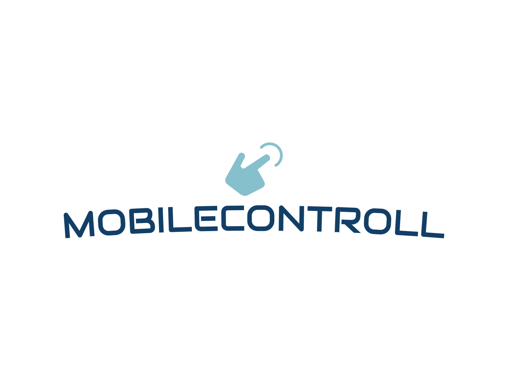

</img>
# mobileControll
With mobileControll you can controll your computer from any device

## how to install
download install.bat from releases, then run it.
it should automatically run, also once your pc connects to internet.
